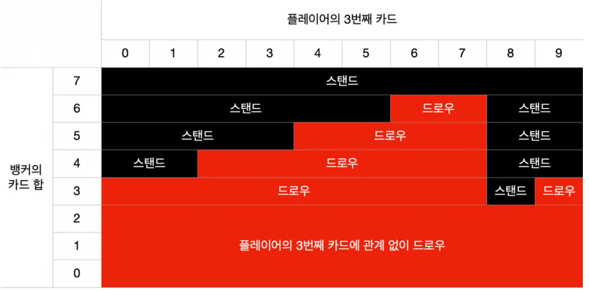

# 순수 Java로 이루어진 OOP 중심의 프로젝트

> https://github.com/jojoldu/oop-java 향로님의 블랙잭 게임 프로젝트를 보고 순수 자바로 이루어진 프로젝트를 만들어야겠다는 필요성을 느끼고 시작한 프로젝트

* Java를 공부하면서 단순한 예제, 실무에서는 주요 기능만 고치고 코드에 대한 깊은 이해는 못해왔던 안좋은 개발습관을 가져왔던 것 같았고 남궁성님 강사님 부트캠프를 들으면서 실습 위주의 공부를 해야겠다는 생각이 들었습니다.
* 내가 작성한 코드에 대한 자신감이 없지만 스스로 프로젝트를 구현해가보면서 부족함을 채우고자 시작합니다.

## 주제

* 바카라 게임을 참고해서 구현할 예정입니다. 세부적인 배팅은 제외하고 플레이어 뱅커 타이(동점) 세 가지 상황의 전제에서만 구현해보도록 하겠습니다.

## 설명

### 게임 규칙

* 플레이어나 뱅커 중 어느 쪽이 이길지 매회 예상하고 배팅합니다.
* 플레이어측과 뱅커측 카드의 합이 9에 가까운 쪽이 이기게됩니다.
* 배팅자는 매 회 플레이어, 뱅커, 한쪽에다 건 후, 양쪽에 카드를 두 장씩 배분하고, 특정 조건에 의해 카드를 한 장 더 받습니다.
* K, Q, J 는 숫자 10으로 카운팅하며, 십의 자리 숫자는 카운트하지 않습니다.
    * ex) 10 + 10 = 0, 8 + 8 = 6, k + 3 = 3, K + Q = 0
* A 는 숫자 1로 계산합니다.
* 타이(동점)의 경우는 건 배팅금액의 9배만큼 돌려줍니다.
* 카드덱은 1개만 사용합니다.
* 파산하면 게임을 종료합니다.
* 뱅커에 걸어서 이겼을 때는 5% 수수료가 발생합니다.

### 카드 받는 규칙

* 우선 플레이어와 뱅커 모두 2장의 카드를 받습니다.
* 플레이어나 뱅커 둘 중 하나라도, 2장의 합이 8 or 9가 되면 내추럴이라고 부르며, 양쪽 모두 추가로 카드를 받지 못합니다. 양쪽 모두 2장만으로 계산되며, 더 높은 쪽이 승리합니다.

**플레이어차례**
* 플레이어 두 장의 수 합이 6 or 7 일 때 스탠드로 카드를 받지 않습니다.
* 플레이어 두 장의 수 합이 0 ~ 5 이면 카드를 추가로 1장 받습니다.
**뱅커차례**
* 플레이어가 스탠드 인 경우 같은 룰로 카드를 받거나 받지 않습니다.
    * 뱅커가 6 or 7이면 카드를 받지 않고, 0 ~ 5 이면 추가로 1장 받습니다.
* 만약 플레이어가 추가로 카드를 받아 3장이되면, 아래 조건에 따릅니다.

* 스탠드는 두 개의 카드로만 플레이어와 점수매김합니다.
* 드로우는 세 번째 카드를 오픈합니다.
* 뱅커의 카드 합이 3 ~ 6 일 때의 스탠드 조건. 0 ~ 2 일 때는 플레어의 카드 상관없이 드로우.

### 진행흐름

1. 카지노 딜러로부터 게임이 시작됩니다.
2. 게이머는 배팅 영역(플레이어, 뱅커, 타이)에 칩을 배팅합니다.
3. 15초 후에 배팅이 마감됩니다.
4. 딜러는 플레이어 -> 뱅커 순으로 각각 2장의 카드를 분배합니다.
( 카드의 총 점수를 보고 마지막 자릿수가 9에 가까운 쪽이 승리합니다.)
5. 플레이어, 벙커 모두 조건에 의해서 모두 추가 카드를 1장만 뽑는 경우가 발생합니다.
6. 조건을 충족시킨뒤, 9점에 가까운 쪽이 승리하며 배팅금액과 동일한 액수의 배당금을 받습니다.
( 뱅커 승리시 승리한 배팅액에 대해서 5%의 수수료가 발생합니다.)

### 객체 정의 및 역할

* OOP설계 SOLID 원칙을 생각하면서 설계하자.

**SOLID**

* S : 
* O : 
* L : 
* I : 
* D : 

### 추상화 코드 구현